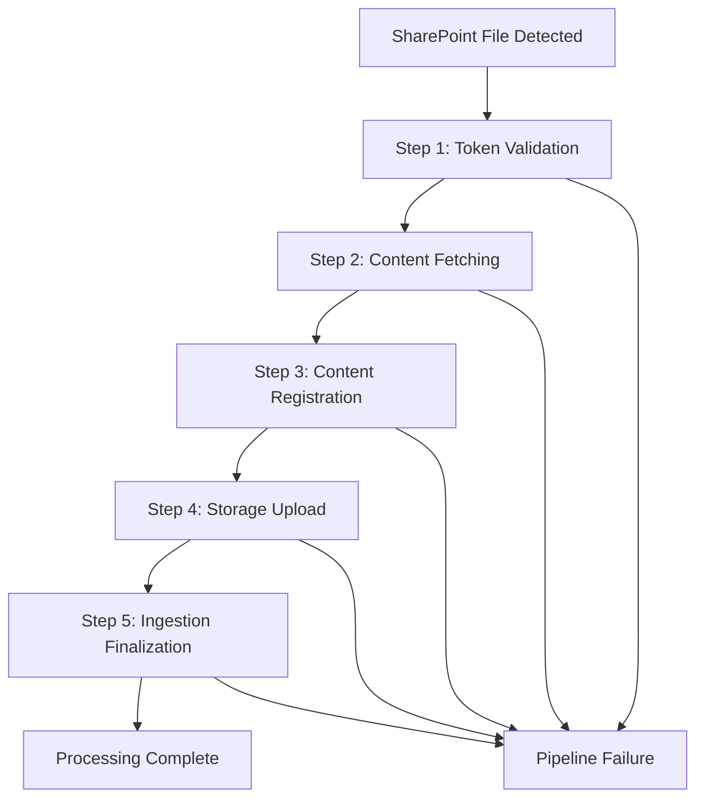

# SharePoint Connector v2

A robust, scalable NestJS service that automatically scans SharePoint sites, processes files through a sophisticated 5-step pipeline, and ingests content into a knowledge management system using distributed processing.

## 🏗️ Architecture

The SharePoint Connector implements a pipeline-based architecture with the following key components:

- **📊 Scheduled SharePoint Scanning** - Automated discovery and diff detection
- **🔄 5-Step Processing Pipeline** - Token validation, content fetching, registration, upload, and finalization  
- **🚦 Distributed Locking** - Redis-backed coordination for multi-instance deployments
- **⚡ Queue-Based Processing** - BullMQ for reliable job processing with retries
- **📈 Comprehensive Monitoring** - Prometheus metrics and structured logging
- **🛡️ Rate Limiting** - Bottleneck-based protection for external APIs
- **🐳 Containerized Deployment** - Docker and Docker Compose support

## 🚀 Quick Start

### Prerequisites

- Node.js 18+ 
- Redis (for queues and distributed locking)
- SharePoint App Registration with Graph API permissions
- Unique API credentials (Zitadel OAuth)

### Local Development

1. **Clone and install dependencies:**
   ```bash
   git clone <repository-url>
   cd sharepoint-connector-v2
   npm install
   ```

2. **Configure environment variables:**
   ```bash
   cp .env.example .env
   # Edit .env with your configuration (see Configuration section)
   ```

3. **Start Redis (if not using Docker):**
   ```bash
   redis-server
   ```

4. **Run the application:**
   ```bash
   # Development mode with auto-reload
   npm run start:dev

   # Production mode
   npm run start:prod
   ```

### Docker Deployment

1. **Using Docker Compose (Recommended):**
   ```bash
   # Start all services (app + Redis)
   docker-compose up -d

   # View logs
   docker-compose logs -f sharepoint-connector

   # Stop services
   docker-compose down
   ```

2. **Build and run manually:**
   ```bash
   docker build -t sharepoint-connector .
   docker run -p 3000:3000 sharepoint-connector
   ```

## ⚙️ Configuration

### Required Environment Variables

```bash
# Application
PORT=3000
NODE_ENV=production

# Redis Configuration
REDIS_URL=redis://localhost:6379
PROCESSING_CONCURRENCY=4
MAX_RETRIES=3

# SharePoint / Microsoft Graph
GRAPH_CLIENT_ID=your-app-client-id
GRAPH_CLIENT_SECRET=your-app-client-secret  
GRAPH_TENANT_ID=your-tenant-id
SHAREPOINT_SITES=site-id-1,site-id-2
SHAREPOINT_SYNC_COLUMN_NAME=FinanceGPTKnowledge
ALLOWED_MIME_TYPES=application/pdf,application/vnd.openxmlformats-officedocument.wordprocessingml.document

# Pipeline Configuration
STEP_TIMEOUT_SECONDS=30
MAX_FILE_SIZE_BYTES=209715200  # 200MB

# Unique API Configuration
UNIQUE_INGESTION_URL=https://gateway.qa.unique.app/ingestion-gen2/v1/content
UNIQUE_INGESTION_URL_GRAPHQL=https://gateway.qa.unique.app/ingestion-gen2/graphql
UNIQUE_SCOPE_ID=your-scope-id
ZITADEL_OAUTH_TOKEN_URL=https://id.qa.unique.app/oauth/v2/token
ZITADEL_PROJECT_ID=your-project-id
ZITADEL_CLIENT_ID=your-client-id
ZITADEL_CLIENT_SECRET=your-client-secret
```

### SharePoint Setup

1. **Register an App in Azure AD:**
   - Go to Azure Portal → App Registrations → New Registration
   - Note the Application (client) ID and Tenant ID

2. **Generate a Client Secret:**
   - In your app registration → Certificates & secrets → New client secret
   - Copy the secret value immediately

3. **Configure API Permissions:**
   ```
   Microsoft Graph API:
   - Sites.Read.All (Application)
   - Files.Read.All (Application)
   ```

4. **Grant Admin Consent** for the permissions

5. **Get SharePoint Site IDs:**
   ```bash
   # Use Graph Explorer or API call:
   GET https://graph.microsoft.com/v1.0/sites/{hostname}:/sites/{site-name}
   ```

## 📋 API Endpoints

| Endpoint | Method | Description |
|----------|--------|-------------|
| `/` | GET | Service status and version |
| `/health` | GET | Health check with uptime and status |
| `/health/ready` | GET | Readiness probe for Kubernetes |
| `/health/live` | GET | Liveness probe for Kubernetes |
| `/metrics` | GET | Prometheus metrics endpoint |
| `/admin/queues` | GET | BullMQ dashboard (dev mode only) |

## 🔄 Processing Pipeline

The service implements a 5-step processing pipeline for each SharePoint file:



### Pipeline Steps

1. **Token Validation** - Validates and refreshes API tokens for Graph and Unique APIs
2. **Content Fetching** - Downloads file content from SharePoint with streaming
3. **Content Registration** - Registers content metadata with Unique API
4. **Storage Upload** - Uploads file content to blob storage using pre-signed URLs
5. **Ingestion Finalization** - Notifies Unique API to trigger indexing

### Error Handling

- **Retryable Errors**: Network issues, rate limits → 3 retries with exponential backoff
- **Non-Retryable Errors**: Authentication failures, invalid files → Logged and marked as failed
- **Timeout Protection**: 30-second timeout per step
- **Distributed Coordination**: Redis-based locking prevents duplicate processing

## 📊 Monitoring & Observability

### Prometheus Metrics

The service exposes comprehensive metrics at `/metrics`:

```
# Pipeline Performance
pipeline_step_duration_seconds{step="token_validation"}
pipeline_step_duration_seconds{step="content_fetching"}
pipeline_step_duration_seconds{step="content_registration"}
pipeline_step_duration_seconds{step="storage_upload"}
pipeline_step_duration_seconds{step="ingestion_finalization"}

# Processing Counters
sharepoint_files_discovered_total{site_id}
sharepoint_files_queued_total{site_id}
pipeline_executions_total{status="success|failure"}
pipeline_step_errors_total{step,error_type}

# System Health
bullmq_queue_size{queue="fileProcessing"}
redis_connection_status
api_requests_total{service="graph|unique",status}
```

### Structured Logging

All operations include structured JSON logs with:
- **Correlation ID** - Tracks individual files through the entire pipeline
- **Context Metadata** - File information, processing state, timings
- **Error Details** - Stack traces and error context for debugging

### Health Checks

- **Basic Health** (`/health`) - Service uptime and basic status
- **Readiness** (`/health/ready`) - Can accept new requests
- **Liveness** (`/health/live`) - Process is alive and responding

## 🧪 Testing

### Running Tests

```bash
# Run all unit tests
npm run test

# Run tests with coverage report
npm run test:cov

# Run tests in watch mode
npm run test:watch

# Run end-to-end tests
npm run test:e2e

# Run specific test suite
npm run test -- --testPathPattern="pipeline"
```

### Test Coverage

The project includes comprehensive unit tests covering:

- ✅ **Pipeline Service** - Complete pipeline orchestration and error handling
- ✅ **SharePoint Scanner** - File discovery and diff detection logic  
- ✅ **Queue Service** - Job creation and queue management
- ✅ **Scheduler Service** - Distributed locking and scan coordination
- ✅ **Metrics Service** - All metric recording and health checks
- ✅ **Pipeline Steps** - Individual step validation and error scenarios
- ✅ **Distributed Lock Service** - Redis-based locking mechanisms
- ✅ **Auth Services** - Token management and API authentication

## 🚦 Rate Limiting

The service implements intelligent rate limiting using Bottleneck:

- **Unique API**: 1 concurrent request, 100ms minimum between requests
- **SharePoint Graph API**: Automatic retry with exponential backoff for throttling
- **Redis-Backed**: Distributed rate limiting across multiple instances

## 🔧 Development

### Project Structure

```
src/
├── common/                 # Shared modules and services
│   ├── auth/              # Authentication services (Graph API, Zitadel)
│   ├── lock/              # Distributed locking service
│   ├── metrics/           # Prometheus metrics and health checks
│   ├── microsoft-graph/   # SharePoint API integration
│   └── unique-api/        # Unique API service integration
├── config/                # Configuration and validation schemas
├── pipeline/              # 5-step processing pipeline
│   └── steps/             # Individual pipeline step implementations
├── queue/                 # BullMQ job processing
├── scheduler/             # Scheduled SharePoint scanning
└── sharepoint-scanner/    # SharePoint file discovery and diff detection
```

### Key Design Patterns

- **Pipeline Pattern** - Sequential step processing with clear interfaces
- **Repository Pattern** - Clean data access abstractions
- **Circuit Breaker** - External API failure protection
- **Observer Pattern** - Event-driven metric collection
- **Strategy Pattern** - Configurable rate limiting and retry policies

### Code Quality

```bash
# Lint and fix code style
npm run lint

# Format code with Prettier  
npm run format

# Build TypeScript
npm run build
```

## 📈 Performance

### Specifications

- **Maximum File Size**: 200MB per file
- **Processing Concurrency**: 4 parallel jobs (configurable)
- **Step Timeout**: 30 seconds per pipeline step
- **Memory Efficiency**: Streaming downloads (no full file buffering)
- **Throughput**: ~50-100 files per minute (depends on file sizes and network)

### Scaling Considerations

- **Horizontal Scaling**: Multiple instances coordinate via Redis
- **Queue Management**: BullMQ handles job distribution and retries
- **Resource Limits**: Configure `PROCESSING_CONCURRENCY` based on available memory
- **Network Optimization**: HTTP connection pooling and keep-alive

## 🛠️ Troubleshooting

### Common Issues

1. **Redis Connection Errors**
   ```bash
   # Check Redis connectivity
   redis-cli ping
   # Should return: PONG
   ```

2. **SharePoint Permission Issues**
   ```bash
   # Test Graph API access
   curl -H "Authorization: Bearer $TOKEN" \
        "https://graph.microsoft.com/v1.0/sites"
   ```

3. **Queue Processing Stopped**
   ```bash
   # Check queue health via metrics
   curl http://localhost:3000/metrics | grep bullmq_queue_size
   ```

4. **Memory Issues with Large Files**
   - Reduce `PROCESSING_CONCURRENCY`
   - Check `MAX_FILE_SIZE_BYTES` setting
   - Monitor memory usage in Docker logs

### Debug Logging

Enable detailed logging for troubleshooting:

```bash
# Set log level to debug
NODE_ENV=development npm run start:dev
```

### Monitoring Dashboard

Access the BullMQ dashboard in development mode:
- URL: `http://localhost:3000/admin/queues`
- Shows active jobs, failed jobs, and queue statistics

## 📄 License

This project is [UNLICENSED](LICENSE).

## 🤝 Contributing

1. Fork the repository
2. Create a feature branch (`git checkout -b feature/amazing-feature`)
3. Commit your changes (`git commit -m 'Add some amazing feature'`)
4. Push to the branch (`git push origin feature/amazing-feature`)
5. Open a Pull Request

### Development Guidelines

- Write unit tests for new features
- Follow existing code style and patterns
- Update documentation for API changes
- Ensure all tests pass before submitting PR

---

For detailed architecture documentation, see [Processing Pipeline Architecture](documentation/processing-pipeline-architecture.md).